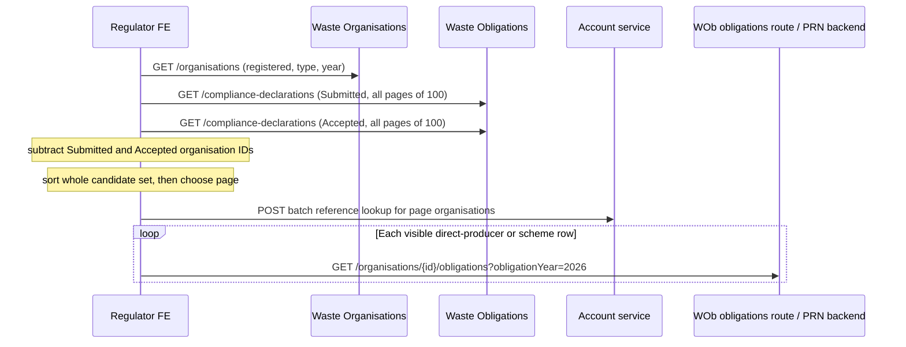
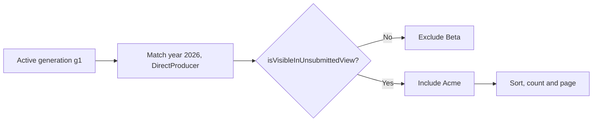

# Unsubmitted compliance declarations: organisation snapshot and query design

## Status and scope

**Status:** the initial server-side delivery is implemented in this branch: the local eligibility snapshot, Account-reference materialisation, direct unsubmitted-visibility and sortable obligation fields on those rows, unsubmitted query endpoint with generic search and indexed sorting, and organisation-obligation summary hydration/polling. The later event-driven and operational-insight sections remain future design considerations. `Unsubmitted` remains an inferred review state rather than a compliance-declaration status.

The delivery is a local, refreshable copy of the Waste Organisations eligibility data in Waste Obligations, with an unsubmitted-visibility field maintained as declarations change, and a separately refreshed organisation-obligation summary. Together they support a server-side query for the **Not submitted** review tab and CSV download.

Account reference resolution is a prerequisite for an individual organisation to enter the queryable unsubmitted view: a source row with no resolved reference is stored and retried, but is not considered. Its value is materialised into the organisation generation rather than hidden behind request-time calls. An organisation's current obligations have a materially different freshness contract, so their full polling state is held in a separate per-organisation/year summary while the two public display metrics are copied into the query aggregate.

## Decisions already made

- `Unsubmitted` is **not** a new `ComplianceDeclaration` status and is not persisted on a declaration.
- It is an inferred review state for an organisation, a registration type, and an obligation year.
- The first source to bring into Waste Obligations is Waste Organisations.
- Waste Organisations is unchanged: its existing, unpaged search endpoint is the source.
- The initial public query route is `GET /compliance-declarations/unsubmitted`.
- The local eligibility rows track `LARGE_PRODUCER` as `DirectProducer` and `COMPLIANCE_SCHEME` as `ComplianceScheme`.

## Current obligation year

Current-obligation hydration is deliberately limited to the **current obligation year**. The obligation year runs from 1 February to 31 January, so calculate it from the business date in the UK time zone:

```text
currentObligationYear = localDate.Month == January
  ? localDate.Year - 1
  : localDate.Year
```

For example, every day from 1 to 31 January 2027 has current obligation year `2026`; 1 February 2027 changes it to `2027`. The implementation uses one tested domain service with an injected `TimeProvider` and the explicit `Europe/London` business time zone, never the host-local clock. The worker calculates the handover once per run and supplies it to its queries, so a run cannot straddle the February boundary with two interpretations.

Eligibility data continues to be loaded for all years, because it is the source needed to identify registrations/status transitions. The rolling obligation-hydration worker operates **only** for `currentObligationYear`, except for the explicit January/February handover below; it must not call the downstream organisation-obligation calculation endpoint for arbitrary historic or future years. Summary hydration is non-blocking: it enriches rows already eligible from the snapshot and declaration state.

The endpoint permits historic and future obligation-year queries against the active eligibility and declaration-state projections. Those queries do not start historic/future polling: where a stored summary does not exist, the response returns `recyclingObligationsMet: null` and `obligationCoveragePercentage: 0`; where a retained summary exists, it returns its last calculated values. Any historical-summary retention or export policy remains separate work.

### January/February year handover

The current-year rule does **not** mean an abrupt stop at midnight. At the UK-time cutover from 31 January to 1 February, use a controlled dual-year handover:

| Period | Outgoing year (`Y - 1`) | Incoming year (`Y`) |
| --- | --- | --- |
| Before cutover | Continue normal rolling refreshes. | Best-effort pre-warming is allowed only from spare downstream capacity; it is not an availability requirement. |
| At cutover | It remains internally refreshed and is available when the caller explicitly selects it (or does not filter by year). | Becomes the normal regulator-view year; rows without a summary are returned with percentage met `0`. |
| After cutover grace | Stop scheduled refreshes; retain the final summaries under normal retention. | Continue normal rolling refreshes. |

This protects both sides of the boundary without making obligation hydration an availability dependency. An incoming-year organisation can be returned immediately when the endpoint changes year, with percentage met `0` until its first summary arrives. An outgoing-year PRN state change at, for example, 23:59 on 31 January must still receive a final organisation-obligation read after midnight; otherwise it could never be persisted locally.

Let `T` be the normal refresh interval and `H` the measured due-work/request completion allowance. Continue outgoing-year refreshes until at least `cutover + (T + H + J)` so the final pre-midnight change is captured. At the cutover, prioritise this outgoing-year catch-up over incoming-year hydration; incoming rows remain visible with the default percentage until normal capacity reaches them. During the brief overlap, the worker may work on both years, but it must honour its ordinary downstream rate limit.

For 500 organisations in both years, a 20-requests-per-minute cap lets the 500 outgoing catch-up reads complete in roughly 25 minutes. It cannot also make every incoming value current in that same window, but it does not need to: membership and display remain available with the default percentage. After the outgoing grace completes, return to normal one-year rolling work. This avoids a temporary rate increase to 40 requests per minute solely to pre-warm a non-blocking metric.

The implementation uses a configurable one-hour `OutgoingYearGracePeriod`: the 30-minute normal refresh interval, up to 25 minutes for the assumed 500-key catch-up at the shared 20-per-minute cap, and a five-minute allowance. During January it attempts incoming-year hydration only when the current-year batch has no due work. During the grace period it marks active outgoing summaries that have not had a successful post-cutover read as `Reconciliation` work, processes that year first, then uses remaining capacity for the new current year. Retries retain their back-off rather than being repeatedly requeued by reconciliation.

## Current frontend behaviour

The frontend route is `GET /certificates-of-compliance`. It has three tabs: `pending`, `accepted`, and `not-submitted`; each is separately selected for either `direct-producers` or `compliance-schemes`. `COMPLIANCE_YEAR` is currently configured as `2026`.

### Existing Waste Obligations declaration search

The frontend client calls Waste Obligations:

```text
GET /compliance-declarations
```

The endpoint (`SearchComplianceDeclarations`) supports `obligationYear`, comma-separated `status`, `registrationType`, `search`, `sort`, `page`, and `pageSize`. It queries the local `ComplianceDeclaration` Mongo collection, counts the result, applies a Mongo sort, then applies `skip` and `limit`.

The list tabs use it as follows:

| UI purpose | Example request |
| --- | --- |
| Pending page | `/compliance-declarations?obligationYear=2026&status=Submitted&registrationType=DirectProducer&page=1&pageSize=20&sort=DateSubmitted[desc],OrganisationName[asc]` |
| Accepted page | `/compliance-declarations?obligationYear=2026&status=Accepted&registrationType=DirectProducer&page=1&pageSize=20&sort=DateSubmitted[desc],OrganisationName[asc]` |
| Tab count | The same Submitted or Accepted request, with `pageSize=1`; the response `total` supplies the count. |
| Search box | `/compliance-declarations?obligationYear=2026&status=Submitted,Accepted&registrationType=DirectProducer&search={term}&page=1&pageSize=100&sort=DateSubmitted[desc],OrganisationName[asc]` |

`registrationType=DirectProducer` and `registrationType=ComplianceScheme` are the Waste Obligations declaration values. The existing declaration search is appropriate for Pending and Accepted because both have declaration documents. It cannot produce an unsubmitted row: no declaration document exists to query, and adding an `Unsubmitted` declaration status would be incorrect.

### Current Not submitted definition

For the selected year and review type, the frontend defines an organisation as not submitted when all of these are true:

1. Waste Organisations reports a matching **registered** registration.
2. There is no Waste Obligations declaration for the same organisation/year/type in either `Submitted` or `Accepted` status.

Consequently, an organisation that has only a `Cancelled` declaration remains in the Not submitted tab. This is covered by the frontend tests and must be preserved unless the business rule changes explicitly.

### Current Waste Organisations calls

The frontend calls the existing Waste Organisations search endpoint:

```text
GET /organisations
```

It always supplies `statuses=REGISTERED` and the compliance year. Its two type-specific variants are:

```text
GET /organisations?statuses=REGISTERED&registrations=SMALL_PRODUCER,LARGE_PRODUCER&registrationYears=2026
GET /organisations?statuses=REGISTERED&registrations=COMPLIANCE_SCHEME&registrationYears=2026
```

The API accepts comma-separated registration types, years, and statuses. It selects an organisation when **any** registration matches every supplied filter, returns an unpaged array, and returns the organisation's complete registration array. A local copy must therefore inspect registrations itself rather than assume every returned registration is an eligible one.

### Calls made for one page view

The summary is loaded for every tab as well as the active tab content. For a Not submitted page it performs the following work independently, so some calls are duplicated between summary and list construction:



For direct producers the Account call is:

```text
POST /api/organisations/organisations-by-externalIds
{ "externalIds": ["{waste-organisations-id}", "..."] }
```

For compliance schemes it is:

```text
POST /api/organisations/organisations-by-companies-house-numbers
{ "companiesHouseNumbers": ["..."] }
```

The obligations call is currently made once per visible Not submitted row. The Waste Obligations route reads the organisation and calls `epr-prn-common-backend` for that organisation/year, then maps material-level obligations into its public DTO. It does **not** return percentage met. The frontend calculates percentage from the returned accepted and obligated tonnages. Waste Obligations does have an equivalent `ObligationCoveragePercentageCalculator`, but currently uses it when a submitted declaration is written (and in the corresponding migration), rather than in this read route. This is why percentage/recycling values are not safe to treat as static organisation data.

The page displays organisation name, organisation reference number, recycling obligations, and either Regulation 43 (schemes) or percentage met (direct producers). Not submitted rows have no declaration ID and no submission date. The frontend currently disables table sorting for this tab; when it adopts this endpoint it should enable the supported server-side fields and correct its reference-number label/key.

### CSV path

The CSV endpoint repeats the same data construction rather than exporting the displayed page.

- Pending and Accepted fetch every declaration page from `GET /compliance-declarations` and map the declaration rows.
- Not submitted repeats the full Waste Organisations search and full Submitted/Accepted declaration scans, then does one Account batch lookup and one obligations request per exported row (with bounded concurrency).
- The CSV does not retain the screen's selected sort. It exports the order produced by its independent fetch path.
- Pending and Accepted CSV calls currently omit `obligationYear`, unlike the on-screen list. That is a behavioural discrepancy to resolve before using CSV as a regression oracle.

## Why the local organisation copy is needed

Waste Obligations already has declarations locally. The missing input is the set of organisations eligible to submit for a given year and review type. Holding that set locally allows Mongo to persist direct membership, page, count, and sort a stable candidate set without transferring every organisation and every matching declaration to the frontend on every request.

The snapshot is an eligibility projection, not a second system of record for organisations. It contains only fields required to establish eligibility and render/order an unsubmitted row.

## Organisation load options and source interface

`epr-prn-integration-function` is the upstream writer of Waste Organisations data from Synapse/Common Data. Its `UpdateWasteOrganisations` timer is currently configured as `1,31 0-7 * * *`: it starts every 30 minutes from 00:01 through 07:31 UTC and writes changed organisations individually. For each invocation, it reads the delta from its last successful cursor to the invocation's `utcNow`, writes the organisations one at a time, and advances that cursor only after all writes complete. Waste Obligations has no event or completion watermark from that flow and therefore cannot know that a particular upstream run is complete merely from the final timer tick.

There are three viable pull shapes:

| Option | Source calls | Advantages | Drawbacks |
| --- | --- | --- | --- |
| Per-year refresh | One search request with `registrationYears={year}` and no status/type filters for each requested obligation year. | Lower payload when only one/few years are served; simple year-scoped recovery. | Calls grow linearly with years; a cross-year backfill may expose some years from a newer source view than others. |
| Full all-years refresh | One unfiltered `GET /organisations`, then locally expand all registrations by year. | One source call; retains every returned registration status; each queryable year comes from the same source response. | Largest response and Mongo write volume on every poll. Must be load-tested against production cardinality. |
| Live source query on each review request | Call Waste Organisations for that request's year/type. | No local copy or refresh job. | Reintroduces frontend-style fan-out, cannot efficiently count/page/CSV with the declaration side, and couples the regulator view to source availability. Not recommended. |

The recommended first implementation is an **all-years full refresh at a configurable interval**, initially proposed as every 30 minutes. This keeps source calls bounded to one per completed poll interval without coupling Waste Obligations to a particular UTC clock time. If production payload size makes it unacceptable, fall back to per-year refresh with the same snapshot semantics.

### Proposed source call: no query parameters

The all-years ingestion client should not filter by type, status, or year:

```text
GET /organisations
```

No query parameters means the Waste Organisations search applies no registration filters and returns every organisation with at least one registration, including its complete registration array. This lets the local copy retain status transitions such as `REGISTERED` to `CANCELLED`, rather than discovering only that a formerly eligible organisation disappeared from a filtered result.

The response is transformed locally into at most two review rows per organisation/year:

| Source registration type | Review type stored locally |
| --- | --- |
| `LARGE_PRODUCER` | `DirectProducer` |
| `COMPLIANCE_SCHEME` | `ComplianceScheme` |

Waste Organisations enforces a unique registration key of `{ type, registrationYear }` within an organisation. Therefore each derived row represents exactly one current source registration, not a collection of registrations: an organisation with both relevant types in the same year has two local rows. Persist the current `registrationStatus`, including `CANCELLED`; filter `registrationStatus = REGISTERED` in the unsubmitted query. This retains the status needed to observe a Registered-to-Cancelled change without inventing an unnecessary local history collection.

`SMALL_PRODUCER` is intentionally not mapped to `DirectProducer`. The source integration confirms this: `epr-prn-integration-function` maps only source `DP`/`DR` to `LARGE_PRODUCER` and `CS` to `COMPLIANCE_SCHEME`; any other source type throws before it PUTs to Waste Organisations.

> **Current frontend defect:** the Direct Producer Waste Organisations query includes `SMALL_PRODUCER,LARGE_PRODUCER`. `SMALL_PRODUCER` is not part of the authoritative integration flow for this feature and must not be carried into the new Waste Obligations projection or endpoint. The frontend should be corrected when it moves to the new endpoint.

### Fetch everything; persist the data needed for the view

The recommended interpretation of “ingest everything” is to fetch every source organisation and registration, then retain all statuses of the two review-relevant types in the query projection. This is sufficient to identify a relevant organisation changing from Registered to Cancelled (or back again), while avoiding a second, uncontrolled copy of unrelated organisation data.

Persisting every source field and every unrelated registration type is a separate option. It provides a local raw-source archive for debugging or future features, but it adds storage, PII ownership, schema-versioning, and a further collection/projection to maintain. It is not required for the initial unsubmitted query. If that audit/archive requirement emerges, add it explicitly rather than allowing the review projection to become an accidental full replica of Waste Organisations.

The implemented downstream adapter is intentionally narrow and uses a source-response model:

```csharp
Task<OrganisationSearch> Search(CancellationToken cancellationToken);
```

This is an internal adapter contract, not a new public API. It must preserve source HTTP failures and cancellation rather than silently returning an empty population, because an empty population would be indistinguishable from every organisation having submitted.

## Data to persist

The query needs two local business projections. `ComplianceDeclaration` remains the authoritative declaration document, but the endpoint does not perform a full declaration join for every page request because the yes/no answer is maintained on the eligibility row at mutation time.

The implementation uses the collection names and indexes described below. Any later persisted-shape change follows this repository's Mongo persistence process.

`activeGeneration` is persisted in Mongo, not application memory or configuration, so every API instance reads the same active view after a restart or deployment. Its physical home is the dedicated `OrganisationEligibilitySnapshot` metadata collection containing one document for the all-years scope:

```json
{
  "_id": "unsubmitted-compliance-declarations",
  "activeGeneration": "g1",
  "activeContentFingerprint": "sha256:...",
  "activeRowCount": 12345,
  "materialisedStateVersion": 17,
  "activeGenerationPromotedAt": "2026-08-26T08:15:00Z",
  "lastVerifiedAt": "2026-08-26T08:14:47Z",
  "retainedGenerations": [
    {
      "generation": "previous-generation",
      "deleteAfter": "2026-09-25T08:15:00Z"
    }
  ]
}
```

The delivery adds purpose-specific persistence for eligibility rows, snapshot metadata, and a single per-organisation/year obligation summary that contains both display metrics and its own hydration state. The eligibility row itself carries the direct inferred-list membership field and the Account-reference result; snapshot metadata is control data. Refresh and hydration leases are two documents, identified by separate lease IDs, in the private `_unsubmitted_organisation_worker_leases` collection. They use the shared `BackgroundWorkerLeaseService` lifecycle implementation and are accessed through purpose-specific adapters rather than the query-data `IDbContext`; the shared collection is not a work queue.

### Writer-neutral projection principle

The persisted query aggregates represent domain state for the unsubmitted view; they are **not owned by the polling workers**. Polling is the current acquisition mechanism because the available upstream interfaces are pull-only. A future Waste Organisations consumer, Recycling-data consumer, or other authoritative domain-event consumer must be able to materialise the same business fields through the same projection rules without adding a new list/query collection.

Consequently, a materialiser must distinguish the fields' domain meaning from their current polling mechanics:

- `OrganisationComplianceDeclarationEligibility` is the organisation/type/year query aggregate. Its registration, reference, visibility, name and copied obligation-metric fields are writer-neutral business state. `generation` is only the current full-snapshot publication mechanism; it is not part of the organisation business identity.
- `OrganisationObligationSummary` is the organisation/year calculation aggregate. Its totals and two public metrics are writer-neutral calculation state. `nextRefreshAt`, `priority`, retry counters and lease activity are the present polling mechanism; a future event can replace the decision to schedule a read without changing the result shape.
- `sourceFingerprint`, `refreshedAt`, `lastSuccessfulReadAt`, and `lastAttemptedAt` record an observation or application of state, not an assertion that polling is the only writer. A consumer must calculate the same canonical fingerprint after it applies an authoritative source state.
- No consumer writes the public aggregate directly from a transport payload. It calls a shared materialiser that validates the source, applies per-source ordering/idempotency rules, recalculates visibility where appropriate, and writes the affected aggregate atomically with its consumer checkpoint/inbox state.

Polling and events must never be concurrent uncontrolled writers of the same logical state. The cutover rules below select one authoritative writer per aggregate/key, retain polling only as explicit reconciliation, and record source provenance so stale/replayed events cannot overwrite a newer result.

### 1. Organisation eligibility snapshot

This is the refreshable Waste Organisations copy. Its job is to decide whether a row is eligible to submit and to provide the locally available row data.

```text
OrganisationEligibilitySnapshot
  id                             "unsubmitted-compliance-declarations"
  activeGeneration               GUID
  activeContentFingerprint       SHA-256 of the canonical derived eligibility set
  activeRowCount                 int
  materialisedStateVersion       monotonic version of in-place visibility and metric writes
  activeGenerationPromotedAt     UTC timestamp of a changed snapshot becoming active
  lastVerifiedAt                 UTC timestamp of the latest successful source read, including no-change polls
  retainedGenerations            bounded rollback/read-safety metadata

OrganisationComplianceDeclarationEligibility
  generation                     GUID
  obligationYear                 int
  organisationId                 GUID
  registrationType               DirectProducer | ComplianceScheme
  name                           string?
  tradingName                    string?          // source provenance; not a public query field
  companiesHouseNumber           string?
  registrationStatus             REGISTERED | CANCELLED
  referenceNumber                string?          // Account value; preserve leading zeroes
  referenceResolutionState       Resolved | Pending | NotFound | Ambiguous | AwaitingLookupKey | Failed
  sourceFingerprint              string           // canonical organisation source state, regardless of poll or event acquisition
  refreshedAt                    UTC timestamp    // state applied/observed time; currently the poll time
  isVisibleInUnsubmittedView     bool             // direct membership for the active endpoint query
  recyclingObligationsMet        bool?            // copied from the last successful local obligation summary
  obligationCoveragePercentage   decimal          // copied from the last successful local obligation summary; defaults to 0
  declarationStateUpdatedAt      UTC timestamp    // latest declaration-state evaluation
```

The unique key is `{ generation, obligationYear, organisationId, registrationType }`. `generation` makes the active data set stable during a refresh. `isVisibleInUnsubmittedView` is the endpoint's complete membership decision: it is true only for a Registered row with a resolved non-empty reference number and no Submitted or Accepted declaration for the same organisation/year/type. Other reference states remain stored for retry/diagnostics but are never visible. `name` is the established `CompanyName` value: Waste Organisations `name` for Direct Producers and `tradingName`, falling back to `name`, for Compliance Schemes. It is both the display and searchable organisation name. The separately retained source `tradingName` is not queried by the public endpoint.

An empty result must never silently mean “every organisation has submitted” when source rows are being excluded for missing references. The current snapshot intentionally records only the active generation, fingerprint, row count, materialised-state version, verification/promotion times, and retained generations. It neither persists reference-coverage counts nor blocks bootstrap on a coverage percentage. The public endpoint deliberately returns only usable list data; reference coverage, freshness, and other diagnostic state are future administration/operational-insight work.

The eligibility row is the query aggregate. It contains the two obligation display metrics as a small write-time copy of the separately retained hydration summary, so the regulator query can match, sort, and page one indexed collection. The copy is updated in the same Mongo transaction that persists a successful hydration result, and is copied forward into a newly staged generation from the current summary. This avoids a request-time `$lookup` and avoids a third projection collection. It also means a future event consumer has one established place to apply changed organisation or calculation state; it must not create a competing list projection. Each in-place visibility or metric transaction increments `materialisedStateVersion`. A generation promotion matches the version it observed while staging, so it cannot replace a concurrent local mutation with an older staged value.

For an all-years refresh, `generation` is global to the refresh, rather than one generation per year. This ensures an endpoint for any year sees rows derived from the same upstream response. `OrganisationEligibilitySnapshot` is control metadata for the eligibility data set. The query reads the eligibility aggregate; the independently refreshed organisation-obligation summary is its polling-state source.

### 2. Unsubmitted visibility

`OrganisationComplianceDeclarationEligibility.isVisibleInUnsubmittedView` replaces the separate declaration-review-state collection. It is the single persisted endpoint membership field, and is set to false for a Submitted or Accepted declaration and true only when the row is Registered, has a resolved non-empty reference number, and has no such declaration for the same organisation/year/type.

The declaration create, status-update, and delete paths recalculate the affected organisation/year/type inside the same Mongo transaction as the declaration mutation and audit-event write, and increment `materialisedStateVersion`. This preserves the required immediate change to the list without a request-time `$lookup` or an additional stored projection. A full eligibility refresh also evaluates all Submitted and Accepted declarations before staging a new generation. Its promotion is fenced by the observed materialised-state version: a declaration committed before promotion prevents the stale stage from becoming active, while one committed after the staged rows exist updates those rows transactionally.

The boolean is deliberately an endpoint read-model field, not a declaration status or public diagnostic field. Operational counts, stale visibility diagnostics, and any future reconciliation endpoint belong to the future administration/operational-insight work.

### 3. Account organisation-reference resolution and materialisation

The Account service is authoritative for the organisation reference number used by the current frontend. It is not a uniform join:

| Review type | Account request | Join rule |
| --- | --- | --- |
| `DirectProducer` | `POST /api/organisations/organisations-by-externalIds` with `externalIds` | Waste Organisations `organisationId` is the Account `externalId`. The Account database has a unique `ExternalId` index. |
| `ComplianceScheme` | `POST /api/organisations/organisations-by-companies-house-numbers` with `companiesHouseNumbers` | A scheme's Waste Organisations ID is **not** an Account external ID. Match by Companies House number, then retain only the returned organisation whose `isComplianceScheme` is true. |

The Companies House route can return several Account organisations for one number. The frontend currently filters `isComplianceScheme` and puts the results into a JavaScript `Map`, so if two matching scheme rows were returned, the last response item would win accidentally. The eligibility refresh must not copy that behaviour: zero matching scheme rows is unresolved and more than one is `Ambiguous`, alerted and withheld until the Account-data rule is resolved. It must never choose an arbitrary reference number. A missing Companies House number is `AwaitingLookupKey`, not a request to Account.

The Account response contracts used by this refresh do not provide a scheme name or scheme-operator name. This is evidenced by the client models: [`AccountOrganisation`](../src/Api/Services/AccountBackend/AccountOrganisation.cs), deserialised from both batch routes by [`AccountBackendService`](../src/Api/Services/AccountBackend/AccountBackendService.cs), has only `externalId`, `referenceNumber`, `companiesHouseNumber`, and `isComplianceScheme`; [`OrganisationWithPersons`](../src/Api/Services/AccountBackend/OrganisationWithPersons.cs), from the separately used `organisation-with-persons` route, has only people. Therefore scheme and operator names are not added to the eligibility aggregate or unsubmitted search. Supporting them needs an explicit Account API contract, data ownership, and change-propagation decision before an additive persisted-field and query change can be designed. A copied Account name would otherwise remain stale after an Account rename until the next eligibility refresh; avoiding that would require an Account change event, deliberately accepted polling staleness, or a request-time join. The latter would undermine the local query path.

Reference numbers are strings, not numbers: preserve leading zeroes and the exact Account value. The expected six-digit format should be monitored, but it should not be silently coerced or truncated.

`referenceNumber` and `referenceResolutionState` are stored directly on the staged eligibility rows. At the start of a refresh, the resolver reads the active generation's rows by `{ organisationId, registrationType }`. A non-empty `Resolved` value is reused across every year in the new source response, preserving the invariant that Account references do not silently change. Other states are not separately persisted as work: each new eligibility refresh batches the unresolved keys through Account again. This removes a second cache/queue collection, retry timers, and cache indexes while keeping the public request path a single local query.

#### How it relates to generations

Materialise `referenceNumber` and `referenceResolutionState` into each staged `OrganisationComplianceDeclarationEligibility` row and include their eligibility-relevant values in the active-content fingerprint. This is preferable to a query-time join because a reference number is now a hard condition for appearing in the view and a generic-search field.

| Design | Strength | Cost / weakness | Decision under the no-reference rule |
| --- | --- | --- | --- |
| Separate reference cache joined by the API | Reference resolution can appear without rewriting a generation. | Generic search must join before count/page; a row with no reference still exists in the candidate population unless the query adds another exclusion. | Not selected. |
| Reference materialised in the staged generation and reused from the active generation | One local query serves filtering, reference search, page and CSV; promotion atomically publishes the reference-bearing eligibility set. | The first successful reference for an organisation causes a later complete generation write; unresolved keys are retried at the next eligibility refresh. | **Selected.** No separate reference-cache collection is retained. |

The required rule is deliberately stronger than “show `No data`”: an organisation with an unresolved reference is stored for provenance and retry, but its row is excluded by `referenceResolutionState != Resolved`. It is not considered unsubmitted, appears in no page/count/CSV, and cannot be found by reference search. Do not omit the source row from the staged generation entirely: retaining it with its resolution state makes retry, source-change detection, and later event hydration possible.

The initial `g1` flow is:

1. Fetch and transform the complete Waste Organisations response into staged source rows.
2. Reuse each active-generation `Resolved` reference for the same organisation/type and make bounded Account batch calls for all remaining distinct unresolved keys.
3. Write every source row to `g1` with either a resolved reference or an unresolved state. Completion here means every Account batch has a recorded outcome; it does **not** mean every organisation has a reference.
4. Validate and atomically promote `g1`. Only its resolved-reference rows are eligible to appear.

For a later source refresh, compare each new row's **source** fingerprint to `g1`. A resolved reference from the active generation is copied forward for the same organisation/type, including when the source row itself changes. Every remaining unresolved key is sent in the bounded Account batch for this refresh. Thus a single genuinely new organisation creates one Account lookup, while resolved organisations are copied into `g2` without a call. Build the complete `g2` and promote it atomically only after the immediate lookup batch has outcomes.

An initial Account timeout blocks the first promotion so the service does not publish a generation while its required reference lookup has failed. A `NotFound` or `Ambiguous` result, and a failed lookup for a newly introduced row after a generation already exists, remain stored as unresolved: the row is excluded and retried by the next eligibility refresh. When it later becomes `Resolved`, the refresh materialises and promotes a complete new generation; it does not mutate active generation rows in place.

This is safe because the stated business invariant is that a reference number never changes once assigned to an organisation ID. The resolver reuses the first non-empty `Resolved` value found in the active generation; conflicting active values fail the refresh rather than selecting one. For a compliance scheme, a change to the source Companies House number after resolution is an integrity signal, not a reason to substitute a new reference automatically. An unresolved scheme may update its lookup key in the next source generation and be retried then.

#### Reference resolution during eligibility refresh

The active eligibility-refresh lease owns the Account calls. For every refresh it deduplicates unresolved Direct Producer organisation IDs and scheme Companies House numbers, calls the two Account batch interfaces in configurable chunks, then materialises the outcome on every affected staged row. A successful non-empty reference is `Resolved`; `notFoundExternalIds`, missing references, an absent scheme lookup key, ambiguous scheme results, and transient HTTP failures remain unresolved and are excluded from the promoted view.

The Account endpoints are already batch interfaces, but the service has no published request-size contract in the code inspected. Use a conservative configurable chunk size and load-test it with the Account team before increasing it. Resolved values are not polled again while present in the active generation. Negative outcomes are retried on the next eligibility refresh rather than retaining a separate retry queue; this deliberately trades a small, bounded batch call every 30 minutes for fewer persisted collections and moving parts. Track unresolved-row count, ambiguous schemes, batch failures, and the number of newly resolved references per generation through future administration/operational insight rather than adding diagnostic fields to the public contract.

#### Serving the materialised unsubmitted view without HTTP fan-out

No change is proposed to `GET /compliance-declarations`: its existing generic `search` already includes its persisted `organisation.referenceNumber`. Account resolution is used only while refreshing the new unsubmitted projection.

The unsubmitted query reads only the active generation and needs no Account call, reference join, summary lookup, or downstream call. Reference numbers and the sortable obligation metrics are already on eligible rows. The page and total are separate local Mongo operations so the page query can use the selected sort index. `obligationYear` and `registrationType` are optional, matching declaration search; when supplied, the latter accepts the same comma-separated list. The unsubmitted endpoint uses the same generic `search` parameter and case-insensitive partial-match semantics as the existing declaration endpoint:

```text
1. Match active generation + isVisibleInUnsubmittedView=true, then optionally obligation year and one or more registration types.
2. Match escaped, case-insensitive contains regex over name OR referenceNumber.
3. For a default or single-field sort, use the selected indexed ordering, then page the matching rows. For multiple sort fields, apply the requested priority order to the matching rows before paging; count the same filter separately.
```

This is entirely local Mongo work. The same unanchored contains limitation remains, but no per-candidate join is required. During the day-one Account backfill, an organisation with a pending reference is excluded from the view altogether; it cannot be found by name or reference until a later promoted generation contains its resolved reference. Monitoring must expose the excluded unresolved-row count and oldest pending age. There is deliberately no request-time fallback to Account: that would make view membership depend on downstream availability and reintroduce HTTP calls into search.

The endpoint has its own `UnsubmittedOrganisationSortField` and `UnsubmittedOrganisationSortDirection`; it does not reuse the declaration-search enums. Like declaration search, it accepts a comma-separated, priority-ordered list of distinct `Field[asc|desc]` terms. `OrganisationName`, `OrganisationReferenceNumber`, `RecyclingObligations`, and `PercentageMet` are valid for both registration types. The endpoint contract is not constrained by the current frontend's displayed columns. Regulation 43 and date submitted are declaration fields and are not valid unsubmitted sorts.

Migration `008_OrganisationEligibilityIndexes` creates the final eligibility indexes directly, rather than retaining transitional scope-first indexes. Migration `009_OrganisationObligationSummaryIndexes` creates the summary indexes. This branch has not been deployed, so no index-replacement or metric-backfill migration is needed:

- eligibility rows: `{ generation, isVisibleInUnsubmittedView, name, organisationId }` for direct membership filtering and deterministic default ordering;
- eligibility rows: `{ generation, isVisibleInUnsubmittedView, referenceNumber, name, organisationId }` for reference-number ordering;
- eligibility rows: `{ generation, isVisibleInUnsubmittedView, recyclingObligationsMet, name, organisationId }` for recycling-status ordering;
- eligibility rows: `{ generation, isVisibleInUnsubmittedView, obligationCoveragePercentage, name, organisationId }` for percentage ordering;
- eligibility rows: unique `{ generation, obligationYear, organisationId, registrationType }`;
- obligation summary: unique `{ organisationId, obligationYear }` and due-work `{ isHydrationActive, nextRefreshAt, priority }`.

The inferred `unsubmitted` boolean is the deliberately materialised membership field on the eligibility row. The Account reference and two scalar obligation display metrics are also materialised there. Regulation 43 does not belong there: it is declaration content and is inapplicable when no declaration exists. The complete hydration state remains in the distinct summary below because a PRN's status can change it after an eligibility generation has been promoted.

### 4. Organisation-obligation-summary hydration

Percentage met is required in the Direct Producer unsubmitted view, and recycling-obligations status is required for both review types. They must be local values: the current frontend makes one obligations request for each visible row and repeats the fan-out for every CSV row. That cannot be retained by a server-side endpoint intended to page, count, search, and export efficiently.

#### What the downstream calculation currently represents

In this section, **PRN backend** is the name of the downstream service and **PRN** means an individual evidence record. The worker does not request or cache individual PRNs. It requests an organisation's current obligation calculation for one year and stores only the derived organisation-obligation summary.

Waste Obligations already calls the PRN backend directly through `IPrnCommonBackendService.ReadObligations(organisationId, year)`. That makes:

```text
GET api/v1/prn/obligationcalculation/{year}
X-EPR-ORGANISATION: {organisationId}
```

The current public Waste Obligations route, `GET /organisations/{organisationId}/obligations?obligationYear={year}`, first validates the organisation in Waste Organisations and, in parallel, makes the above current-obligation calculation call. A background hydrator already has a valid local eligibility row, so it must call `IPrnCommonBackendService` directly, **not** call the public Waste Obligations route. That avoids an unnecessary Waste Organisations HTTP request per hydrated row and avoids routing internal work back through the API surface.

The PRN backend's calculation endpoint combines two inputs:

- stored `ObligationCalculations` for the organisation/year, which are recalculated once per day by its separate obligation-calculation process; and
- a live aggregate of the organisation's `ACCEPTED` and `AWAITINGACCEPTANCE` PRN records for that year.

Consequently, a state change to an individual PRN is the **only real-time input** that can change an organisation's returned obligations. It can alter accepted tonnage and percentage without a new Waste Organisations generation or daily calculation run. The obligation calculation itself is the other input, but changes only at its daily recomputation. The initial model does not track either input directly. Instead, it periodically re-reads each current-year organisation's calculated obligations. One rolling refresh mechanism therefore covers both kinds of change without polling individual PRNs. A successful local read is an observation of those two inputs, not immutable organisation data.

The new worker must calculate the display value in Waste Obligations, using the existing `ObligationCoveragePercentageCalculator`: sum the mapped material `accepted` and `obligated` tonnages, calculate `accepted / obligated * 100`, cap at 100, and round to a whole number away from zero. Extract/reuse this as a tested mapper or calculator method accepting the PRN response model, rather than copy the JavaScript frontend calculation. On an empty successful response, preserve today's Not submitted behaviour: `recyclingObligationsMet` is `null` and percentage met is `0`.

#### Projection and hydration state

The delivery has a per-organisation/year summary; `registrationType` is intentionally not part of its key because the PRN backend's organisation-obligation calculation endpoint is keyed only by organisation and obligation year. This lets one summary be reused if an organisation is represented by more than one eligibility row.

```text
OrganisationObligationSummary
  organisationId                 GUID
  obligationYear                 int
  obligationCount                int             // zero is a successful, empty result
  totalAcceptedTonnage           int
  totalObligatedTonnage          int
  recyclingObligationsMet        bool?           // exact current frontend/domain semantics
  obligationCoveragePercentage   decimal?        // whole number; 0 for a successful empty result
  sourceFingerprint              string           // canonical mapped organisation-obligation result, for no-op writes/telemetry
  lastSuccessfulReadAt           UTC timestamp   // when Waste Obligations last applied the canonical calculation result
  dailyCalculationRunId          string?          // populated when the source later supplies a run-completion watermark
  lastAttemptedAt                UTC timestamp
  nextRefreshAt                  UTC timestamp
  priority                       NewEligible | ScheduledRefresh | Retry | Reconciliation
  requestedAt                    UTC timestamp
  isHydrationActive              bool            // false state is retained but cannot be selected for polling
  refreshState                   Ready | Pending | Failed
  attemptCount                   int
  lastFailure                    optional, bounded diagnostic
```

When a suitable event contract is introduced, expand this same document with optional calculation-trigger source state rather than adding an event-only summary or queue collection:

```text
OrganisationObligationSummary (future event activation)
  calculationTriggerSources      one state per source: source name, source version/sequence,
                                  event ID, occurredAt, appliedAt
  calculationRequestedAt         UTC timestamp of the latest accepted trigger
  priority                       adds EventTriggered; it coalesces to one due key with scheduled/retry work
```

Those fields let a Recycling-data consumer reject a stale/replayed trigger while still asking the existing canonical calculation materialiser for the result. They are operational provenance, not public endpoint data. They must be introduced by an additive migration before the consumer is enabled; existing polling documents remain valid without them.

There is exactly one summary document for an organisation/year. It combines the local last result and bounded polling state so a second Mongo work-queue collection is not required. Use the unique index on `{ organisationId, obligationYear }` and a due-work index on `{ isHydrationActive, nextRefreshAt, priority }`. The worker deactivates a summary when its organisation is no longer an active registered row with a resolved reference; retained metrics then remain available for diagnostics but that document cannot be selected for a PRN call. On a successful summary write, the worker atomically copies the two public display metrics to every matching eligibility row (including a staged generation). The public endpoint consequently reads no summary collection. Neither path is joined to Account or any remote service at request time.

This key is already event-ready: a future Recycling-data event identifies the same `{ organisationId, obligationYear }` record. It must record that a canonical calculation is required and coalesce with any already-due work; it must not try to derive or overwrite totals from the event itself. The existing calculation materialiser remains the only writer of calculated totals/metrics, regardless of whether its read was initiated by a periodic due time or an accepted event.

Persisting material-level obligations is not required for this list. The totals, status, percentage, source fingerprint, and timestamps are enough to render today's columns and diagnose the calculation. If a later API must return a material breakdown, add a deliberately versioned nested snapshot then; do not turn this list projection into an unbounded PRN archive.

#### Hydration lifecycle

The obligation hydrator is a second interval worker using the shared `BackgroundWorkerLeaseService` lifecycle, with its own lease ID, `organisation-obligation-hydration`, in the private worker-lease collection. Its lease is independent of the organisation-refresh lease. It acquires-or-skips, renews before/while a bounded batch is processed, and atomically updates the single summary document with the hydration outcome. A failed lease renewal cancels the remainder of that batch; another host can resume it after expiry. It uses the dedicated `IOrganisationObligationSource` integration client: the OAuth and resilience configuration is shared with the request client, but it intentionally does not propagate request-scoped trace headers from an inbound API request.

On a changed organisation generation, restrict all obligation work to `obligationYear = currentObligationYear`:

1. Identify active rows for the current obligation year that are `REGISTERED` and have a resolved reference. Deduplicate them to organisation/year keys. A newly eligible key inserts a `Pending`, `NewEligible` summary due immediately; an existing summary is reactivated without losing its metrics or next scheduled refresh.
   Before selecting due summaries, deactivate active current-year summaries that no longer satisfy those active-generation conditions. This prevents a cancellation or an unresolved reference in a later generation from continuing to generate PRN calculation calls.
2. Reuse an existing summary for source-identical rows until its `nextRefreshAt` is due. A reference becoming resolved reactivates the existing organisation/year summary without changing the PRN key.
3. The obligation worker selects a bounded due summary batch, calls `IPrnCommonBackendService.ReadObligations` for each key with deliberately low, configurable concurrency, maps the result, and atomically updates that same summary and the matching eligibility-row display metrics. A result with an unchanged `sourceFingerprint` updates freshness timestamps but still preserves the direct query projection.
4. A transient PRN failure records `Failed` and uses capped exponential back-off. It does not alter declaration presence or organisation eligibility. A successful empty response is `Ready`, not a failure.
5. Schedule every `Ready` current-year summary for its next read at `lastSuccessfulReadAt + RefreshInterval`. Do **not** wait for, or poll for, a PRN-state signal. A change in either source input is picked up at that organisation's next scheduled read.
6. Spread the due times deterministically over each interval, for example by using a stable hash of `{ organisationId, obligationYear }` as a slot within the interval. For the initial assumption of `K = 500` and a 30-minute interval this makes about 17 calls due each minute, rather than a 500-call burst at one clock time. The worker claims small due batches under its lease and uses the singleton `OrganisationObligationRequestPacer` to reserve one evenly spaced downstream slot at the shared 20-requests-per-minute limit. Low concurrency (initially two requests) separately bounds in-flight calls. New-organisation reads and retries pass through the same pacer; the limit cannot be bypassed by a separate retry path. A full batch starts the next batch without the normal idle wake delay, so pacing remains capable of 20 requests per minute.
7. Do **not** poll individual PRNs or poll a PRN-change feed in this implementation. There is no suitable PRN-state trigger today, and such polling would create unacceptable volume. A PRN state change and a daily `ObligationCalculation` change are both reflected no later than the next rolling organisation-obligation read, subject to retry/failure handling.
8. Retain a low-frequency full current-year `Reconciliation` sweep only as repair for failed hydration state or projection drift. It is not an additional near-real-time polling mechanism.

At the 1 February UK-time boundary, the worker applies the dual-year handover described above: it has already pre-warmed the new current year, continues the previous year for its post-cutover grace, then stops scheduled work for that outgoing year. Previous-year summaries may be retained under a normal operational retention policy and can be returned by an explicit historical-year or all-years query; their metrics are not refreshed after the outgoing-year grace.

**Side requirement — summary retention.** The unique `{ organisationId, obligationYear }` key prevents repeated polling and retries from creating duplicate state: there is one summary per organisation/year, and two years are active only during handover. The `isHydrationActive` flag removes ineligible and outgoing summaries from the polling path without discarding their last metrics. Before long-term historical operation, agree a bounded cleanup or expiry policy for obsolete summaries; retention remains a diagnostic-data decision and does not alter the query's membership rules.

Do not wait for this work as part of an organisation-generation promotion. The reference is a stable identity value and a hard membership condition; the current-obligation percentage is a volatile display metric. If a PRN status change rewrote the complete eligibility generation, it would cost `O(M)` eligibility writes and repeatedly invalidate otherwise unchanged organisation data. The selected split instead costs one organisation-obligation calculation read and one summary upsert per affected organisation/year, while the organisation generation remains unchanged.

#### Non-blocking obligation enrichment

Organisation-obligation hydration is not an eligibility or endpoint-availability condition. A candidate belongs in the view solely because it has a registered eligibility row, a resolved reference number, and no Submitted/Accepted declaration. The endpoint must behave as follows:

- no `OrganisationObligationSummary` yet: return `obligationCoveragePercentage: 0` and `recyclingObligationsMet: null`;
- current `Ready` summary: return its calculated percentage and recycling-obligations result;
- failed or stale summary: return its most recently calculated percentage and recycling-obligations result when one exists, otherwise the same `0`/`null` default.

The frontend can initially display the percentage as `0%`, as required. Operational freshness/state and the successful-read timestamp are not part of this public contract; a future administration endpoint can expose them for support and alerts. The worker's freshness window produces alerts and retry work, not `503` responses. The endpoint still fails closed for a stale **eligibility** snapshot, because that can make organisations disappear or appear incorrectly; a missing obligation summary cannot.

#### Empty-system bootstrap example: approximately 500 organisations

Assume an initially empty Waste Obligations deployment and `K = 500` distinct active organisation keys for the **current obligation year** after the source response is expanded. Assume each has one relevant registration and every required Account reference can be resolved. An organisation may have review rows for other years in the eligibility generation, but those rows do not create current-obligation work or downstream calls.

| Stage | External requests | Volume for this example | When it happens |
| --- | --- | ---: | --- |
| Organisation snapshot | `GET /organisations` to Waste Organisations, with no query parameters | **1** request | At the first acquired eligibility-refresh lease, after bounded startup jitter. |
| Reference resolution — Direct Producers | Account external-ID batch endpoint | `ceil(D / B_d)` requests, where `D` is the number of direct-producer keys and `B_d` is the agreed batch size. | Immediately after source transformation, before `g1` is promoted. |
| Reference resolution — Compliance Schemes | Account Companies-House-number batch endpoint | `ceil(H / B_s)` requests, where `H` is the number of distinct scheme Companies House numbers and `B_s` is its agreed batch size. | In the same initial resolution phase. |
| Declaration state | Local evaluation of existing Submitted/Accepted declarations while the eligibility generation is staged | **0** external HTTP requests | Before the generation is promoted; an empty declaration collection leaves all otherwise eligible rows visible. |
| Obligation hydration | Direct organisation-obligation calculation call through `IPrnCommonBackendService` | **500** requests: one for each distinct organisation/year key. | Immediately after `g1` is promoted and its work has been enqueued. |

For illustration only, if Account accepts batches of 100 and all 500 are Direct Producers, the Account step is five requests. If 250 are Direct Producers and 250 are schemes with distinct Companies House numbers, it is three requests to each Account endpoint, six in total. The actual Account batch limit is not currently a published contract and must be agreed; it is deliberately configurable. Scheme lookups are deduplicated by Companies House number, so shared numbers reduce the request count.

The initial external-request total is therefore:

```text
1 Waste Organisations request
+ ceil(D / B_d) Account external-ID requests
+ ceil(H / B_s) Account Companies House requests
+ K organisation-obligation calculation requests
```

There is no initial scan of `GET /compliance-declarations`, no request to `epr-prn-integration-function`, and no request-time Account/current-obligation call from the unsubmitted endpoint. Declaration state is already local to Waste Obligations and is backfilled from Mongo.

`g1` can be promoted once source rows and Account outcomes are recorded. `GET /compliance-declarations/unsubmitted` can then return its eligible unsubmitted organisations immediately, without waiting for the 500 organisation-obligation calculation calls. Until an individual summary is hydrated, that row returns percentage met `0` and recycling-obligations status `null`. It is still entirely served from local Mongo.

The organisation-obligation calculation endpoint has no batch operation. With the initial shared cap of 20 requests per minute, the 500-key bootstrap takes at least 25 minutes, before downstream latency, timeout, throttling, and Mongo-upsert time are considered. Low concurrency bounds short bursts; the paced rate limit bounds the aggregate request volume. Do not publish a bootstrap time SLA before production-like load testing.

The initial implementation does not directly signal the hydration worker when `g1` is promoted. New keys are due immediately and are discovered on the next ordinary worker wake-up, adding at most that wake interval before the bootstrap drain begins. This is an accepted non-blocking edge case: it does not affect organisation membership or endpoint availability, and a future direct signal may reduce bootstrap latency if measurements show that it matters.

The recommended initial `RefreshInterval` is **30 minutes**. It is a balanced starting point for roughly 500 organisations: every organisation's current obligations are at most about 30 minutes plus queue/retry delay behind either a PRN state change or the daily obligation-calculation update, while the normal downstream rate stays low and even.

| Refresh interval | Reads for 500 current-year organisations | Average downstream rate | Approximate daily volume | Assessment |
| --- | ---: | ---: | ---: | --- |
| 15 minutes | 500 every 15 minutes | 33/minute (0.56 req/s) | 48,000/day | Fresher, but doubles avoidable volume before there is a change signal. |
| **30 minutes** | **500 every 30 minutes** | **17/minute (0.28 req/s)** | **24,000/day** | **Recommended initial window.** |
| 60 minutes | 500 every 60 minutes | 8–9/minute (0.14 req/s) | 12,000/day | Lower load, but too stale for a user-driven accept/reject outcome. |

Use a short worker wake-up/lease-attempt interval (for example one minute) only to claim due, new-organisation, or retry work. It does not cause downstream reads when no work is due. The due-work selector matches one obligation year and active state, then sorts by priority and due time. Its index is therefore `{ obligationYear, isHydrationActive, priority, nextRefreshAt }`; it limits the ordered result before any downstream read. For the recommended interval, spread the 500 calls across the 30-minute window, process at low configured concurrency (initially two), and enforce a shared, paced 20-requests-per-minute client-side rate limit. This is a controlled average of 17 calls per minute, not a 500-call burst. The cap leaves about 3 requests per minute of normal headroom for retries and newly eligible organisations. Confirm the downstream behaviour with a production-like load test and the PRN backend owners.

A new eligible organisation becomes due for one calculation read immediately and is picked up on the next worker wake-up. A source-only change such as a name change reuses the current summary and adds none. A declaration submission/cancellation updates local declaration state immediately and adds none. The trade-off is explicit: this does **not** make PRN status live; a status change is normally visible at the organisation's next 30-minute read. If a future durable PRN-state event becomes available, it can enqueue one affected organisation/year calculation read, but it is not part of this initial design and does not justify polling for PRN changes now.

#### Future consideration: weighted refresh frequency

The initial policy intentionally gives every current-year organisation the same 30-minute target. If the active population grows beyond the assumed 500 keys, do not increase the global request cap or silently lengthen every organisation's refresh interval without an explicit capacity and business decision. For example, 1,000 keys require an average 33 requests per minute and 2,000 keys require 67 requests per minute to retain a 30-minute target; at the initial 20-per-minute cap they cannot do so.

A future policy may assign a longer normal refresh interval to lower-impact organisations while retaining a global cap. It should be based on agreed local inputs, such as the registration type and the annual obligated tonnage from the last successful summary, rather than a guess based on organisation type alone. The business must define the bucket thresholds, maximum staleness per bucket, bootstrap treatment before a first successful read, reclassification rules, fairness/starvation guarantees, and how the policy is exposed in monitoring. Until that work is agreed, every organisation uses the same interval and a state-changing retry continues to use the shared capped quota.

#### Serving, CSV, and sortable metrics

The endpoint directly matches visible eligibility rows, counts them, and uses a matching compound index to sort/page default and single-field requests. The sort indexes begin with the two required predicates rather than the optional year/type filters, so the same four indexes can serve every filter combination without a blocking Mongo sort. When a caller supplies year and/or type, Mongo applies those as residual predicates while it scans the selected active-generation index order. The CSV reads the same copied values in bounded Mongo batches. Neither path calls the PRN backend or looks up the summary collection. A row may hold a `null` recycling state and zero percentage before its first successful read; a failed refresh preserves its previously copied values.

For the assumed 500 organisations, and the 1,000 and 2,000 organisation extrapolations, this bounds a default/single-sort query to scanning at most the active visible population rather than an unbounded historical collection or a request-time join. The trade-off is deliberate: retaining separate year/type-prefix sort indexes for every optional-filter combination would multiply indexes and generation write cost, while an arbitrary multi-field sort already requires a bounded in-memory sort. Monitor `keysExamined`, `docsExamined`, and page latency as the population grows; revisit the index strategy if the active visible population materially exceeds the current planning range.

The contract accepts multiple unsubmitted-specific sort terms in priority order. A default or one-term request appends deterministic tie-breakers (`name`, then `organisationId`) using the requested direction, allowing the corresponding compound index to serve ascending and descending scans. Multiple terms preserve the requested order and append the same tie-breakers when absent. Indexing every field order and direction combination would create an unreasonable combinatorial index set, so Mongo performs a bounded in-memory sort of the already scoped membership set for those requests. An unanchored generic-search regex likewise requires candidate scanning and in-memory sorting of the matching subset; the selected sort indexes serve the normal unfiltered single-sort list path.

Regulation 43 remains inapplicable for an unsubmitted scheme because it is declaration content, not PRN content. Date submitted is likewise not a field of this result.

## Refresh design

Waste Organisations offers neither paging nor a change cursor for this query. Therefore the initial implementation is a full, bounded poll. It should be a `BackgroundService`, following the existing hosted-service pattern, with a Mongo-distributed lease so multiple API instances do not refresh concurrently.

### Cross-host refresh lease

Follow the existing recurring-worker lease lifecycle in `AuditEventLeaseService` / `AnalyticsAuditEventProcessor`, rather than the startup-only `MongoMigrationService` pattern. The audit-event lease has the required lifecycle for deployed multi-host workers: an instance-specific owner ID, expiry, atomic acquire-or-skip, renewal while processing, and owner-only release.

The organisation worker owns its private operational collection directly through its lease service; it must not reuse the audit-dispatch process name, couple the refresh to audit-event data, or add the lease collection to the query-data `IDbContext`. Values:

```text
leaseId:      organisation-eligibility-refresh
collection:   _organisation_eligibility_refresh_lease
document _id: organisation-eligibility-refresh
```

The lease document follows the existing shape:

```json
{
  "_id": "organisation-eligibility-refresh",
  "owner": "{machine-name}-{instance-guid}",
  "expiresAt": "2026-08-26T08:20:00Z",
  "createdAt": "2026-08-26T08:15:00Z",
  "updatedAt": "2026-08-26T08:15:00Z",
  "lastReleasedAt": null
}
```

Each host uses the same configurable `RefreshPollIntervalSeconds`; it is not a cron schedule. The worker attempts a run, then waits that interval. Every attempt calls `TryAcquire`. Mongo atomically grants the lease only when it has expired or is already owned by that same instance. Hosts that do not acquire it log the skip and return; they do not wait or run a duplicate poll.

The owner must renew the lease throughout the source request, transformation, and every bounded bulk-write sequence. If renewal fails, it must cancel the refresh and **must not promote** the staged generation. Immediately before the metadata pointer is changed, renew/check ownership again. Release in `finally` by unsetting the owner and expiring the lease, as the audit-event worker does. If a host crashes, another host can acquire the lease after expiry and safely create its own staged generation.

Lease duration and renewal cadence are configuration. The duration should exceed a normal bulk-write batch, not the full expected refresh duration; renewal provides safe ownership for longer runs. Record the same operational outcomes as the existing pattern: acquired, not acquired, renewal failed, released, and processing duration.

The periodic poll intentionally is not aligned to the upstream cron. A poll can occur while the integration function is still writing, but the next poll produces a complete new local generation from the then-current Waste Organisations view. This makes deployments and active multi-host instances simple: all hosts run the same interval loop and the lease selects one. It does not turn the upstream schedule into a completion SLA. If there are manual Waste Organisations changes outside the integration function, they are visible to the next successful poll rather than waiting for the overnight integration window.

One refresh run should work as follows:

1. Acquire an `eligibility-organisations` lease. If another instance holds it, skip this interval.
2. Fetch the single combined Waste Organisations search response with a timeout and normal HTTP resilience policy.
3. Validate the response, then expand every relevant source registration into one `{ organisationId, obligationYear, registrationType }` eligibility row. Retain its current status for `LARGE_PRODUCER` and `COMPLIANCE_SCHEME`, including non-`REGISTERED` statuses; ignore unrelated registration types in the derived projection.
4. For every derived row, calculate its Waste Organisations-only `sourceFingerprint`. Reuse a known resolved reference from active-generation rows with the same organisation/type; make bounded immediate Account batch calls for every remaining unresolved key.
5. Materialise the Account outcome on every staged row. A successful reference produces `Resolved` plus its string value; every other outcome produces an excluded unresolved state. Record source/row/duplicate/reference-outcome counts for diagnostics.
6. Canonically sort the complete materialised set and calculate its semantic `activeContentFingerprint`. The fingerprint includes each row's `sourceFingerprint` and either its resolved reference value or one common `Unresolved` marker; it excludes retry timestamps and distinctions between non-eligible states such as `Pending` and `Failed`.
7. Compare that fingerprint with the active generation in metadata.
8. If the fingerprint is unchanged, atomically update `lastVerifiedAt` and retained-generation metadata. Do **not** create a generation, write eligibility rows, or alter the active pointer.
9. If the fingerprint changed, bulk-write individual materialised eligibility documents under a new generation. The write key is `{ generation, obligationYear, organisationId, registrationType }`; do **not** modify the active generation in place.
10. Verify the intended row count was written. Only after every bulk write succeeds, atomically switch snapshot metadata to the new generation, fingerprint, `activeGenerationPromotedAt`, and `lastVerifiedAt`.
11. Delete old generations asynchronously after a retention period. A failed run never changes the active generation.

This gives readers a complete old snapshot or a complete new one—never a partially refreshed population. It also avoids a failed source call being interpreted as no organisations.

The current transformation rejects duplicate organisation/year/registration-type keys and the refresh verifies the written-row count before promotion. A sudden source/row-count collapse guard and a policy for a legitimate zero-result replacement are future operational hardening; the current code does not treat them as a separate promotion gate.

### Minimising data churn on frequent polls

With the original generation-only description, every 30-minute poll would create a full new set of eligibility documents, even when Waste Organisations had not changed. That is safe but unnecessarily expensive. The poller should instead use **copy on semantic change**. The full-set fingerprint comparison happens **before** any staged-generation write:

1. It must still call unfiltered `GET /organisations`. Waste Organisations exposes neither a change cursor nor a conditional/ETag contract in the current interface, so there is no safe way to know that the source is unchanged before reading it.
2. It transforms the response into source rows, reuses/calls Account resolution as described above, then forms precisely the materialised eligibility fields that would be persisted. It sorts rows by `{ organisationId, obligationYear, registrationType }`, serialises the row components canonically, and hashes that value. It excludes retrieval timestamps, response ordering, transport-only fields, and distinctions between unresolved reference states.
3. If that full-set hash equals `activeContentFingerprint`, the poll is successful but is a **no-change** outcome. Update the small metadata document's `lastVerifiedAt` and metrics only. Existing eligibility rows and their generation remain untouched.
4. If the hash differs—because source data changed or an unresolved reference became resolved—create and validate `g(n+1)`, then promote it as described below. The old data remains active until that promotion.

The fingerprint deliberately covers the **derived materialised projection**, not the raw source response. A source change to an ignored registration type or an unpersisted field therefore does not create a new generation. An Account retry changing `Pending` to `Failed` also does not create one because neither value makes the row eligible; the first resolved reference does. This eliminates Mongo eligibility-row churn entirely when there are no relevant changes. It also means the endpoint can truthfully report that the source population was recently checked even when the data generation was last promoted days earlier. `lastVerifiedAt` is the freshness value for the endpoint; `activeGenerationPromotedAt` is the last time queryable data actually changed.

When only a few organisations change—or a small number of references become resolved—the first implementation should still write a complete new generation. It performs one full source GET and one full local generation write *only on a semantic materialised-view change*, preserving the simple, indexed query that selects one generation. The per-row `sourceFingerprint` remains useful for diagnostics and later optimisation, but must not cause an in-place partial update of the active snapshot.

#### Fingerprint algorithm and cost

The fingerprint is cheap relative to an HTTP download and a full Mongo generation write, but it is not free: Waste Obligations must inspect every relevant source registration because the current source has no change token. Let `N` be the number of organisations, `R` the number of relevant `LARGE_PRODUCER`/`COMPLIANCE_SCHEME` registrations, and `M` the derived `{ organisationId, obligationYear, registrationType }` rows.

1. Read each source organisation and retain only the fields that would be stored in the eligibility projection. Convert each relevant source registration into its derived row and validate the source's `{ organisationId, type, registrationYear }` uniqueness.
2. For each row, calculate `sourceFingerprint`: SHA-256 over a versioned, length-prefixed canonical encoding of its key and Waste Organisations fields. Resolve/copy its Account value. The active content fingerprint incorporates the source fingerprint plus either the exact resolved reference string or the common `Unresolved` marker; no separate per-row materialised-fingerprint field is stored.
3. Sort the small row descriptors by the composite row key using ordinal comparisons. Do not rely on Waste Organisations response order, which is not a source contract.
4. Calculate `activeContentFingerprint` as SHA-256 over a version tag, the row count, and the ordered `{ row key, source fingerprint, resolved reference or Unresolved }` components. Persist and compare the resulting digest and row count in snapshot metadata.

Hashing row fingerprints rather than serialising a second giant JSON document avoids a large temporary string/byte array and makes the source/materialised fingerprints reusable for diagnostics. It also means a source response that merely changes array ordering produces the same fingerprint.

| Work | Cost per poll | Notes |
| --- | --- | --- |
| Download and JSON parse | `O(source response bytes)` | Unavoidable with the current all-organisations endpoint. |
| Transform and row hashing | `O(R + M)` | One pass over relevant registrations/derived rows. |
| Resolved-reference reuse / unresolved batches | `O(M)` local active-generation read; Account calls scale with unresolved keys | Existing resolved references are copied forward. Batch and bound all remaining Account work. |
| Deterministic ordering | `O(M log M)` time, `O(M)` row-descriptor memory | Necessary because source ordering is not guaranteed. |
| No-change Mongo work | `O(1)` eligibility writes | A metadata update plus the normal lease operations; no eligibility rows are touched. |
| Changed Mongo work | `O(M)` eligibility writes | A complete `g(n+1)` is written to retain atomic simple-snapshot semantics. |

In practical terms, the no-change path trades one full source download, parse, transform, and in-memory sort for avoiding `M` Mongo document writes, their index updates, generation retention, and later cleanup. At normal population sizes, source I/O and Mongo writes should dominate SHA-256 CPU; profile with production-like data rather than assume this. If the payload makes memory material, deserialize the HTTP response as a JSON stream and retain only the `M` compact row descriptors needed for sorting/fingerprinting, rather than retaining a second full source object graph.

SHA-256 is a content fingerprint, not a mathematical proof of equality. Prefixing an algorithm/schema version and row count prevents accidental incompatibility as the projection changes; the probability of an accidental collision is negligible for this operational use. If that residual risk is not acceptable, the no-change path must instead perform an exact canonical row-by-row comparison with the active generation, adding a full Mongo read and substantially reducing the benefit.

#### Mongo change-identification query

The implemented no-change decision does **not** compare rows in Mongo and does not write `g2`: it compares the complete content fingerprint and row count held in the one snapshot-metadata document. A full `g2` is written only after that comparison establishes that the derived set differs.

No row-difference aggregation is stored or run in the initial delivery. If future diagnostics need to classify additions, removals, source changes, and reference-resolution changes, they must use the actual unique key `{ generation, organisationId, obligationYear, registrationType }` and derive the reference component from `referenceNumber` and `referenceResolutionState`; the current document deliberately has no persisted `materializedFingerprint` field. Such analysis remains outside the API request path.

| Approach after a sparse change | Mongo writes | Query/correctness cost | Decision |
| --- | --- | --- | --- |
| Full copy on semantic change | Full generation only when the derived set differs. | The existing one-generation query and atomic pointer swap remain simple. | **Recommended initially.** |
| Delta overlay with changed rows and tombstones | Only changed/new/removed rows. | Queries must resolve an overlay chain before filtering, sorting, counting and CSV export; periodic compaction is required. This risks reintroducing mixed-snapshot errors. | Defer unless measured full-copy cost is unacceptable. |
| Update active rows in place | Only changed rows. | Cannot atomically represent changes and removals from a full source read without pending/run markers and delayed deletion. | Not recommended. |
| Source change cursor, event, or ETag | Potentially avoids the full GET too. | Requires Waste Organisations contract support that does not exist today. | Future source-interface improvement. |

The eligibility worker logs the `Unchanged` or `Promoted` outcome and row count. Source GET duration/bytes, row-write counts, full-set fingerprint diagnostics, and promotion-duration metrics are future operational telemetry. Load-test this with production-like population size before deciding whether sparse-change overlays are warranted.

### Generations, promotion, and old data

A generation is the identifier for one *complete, semantically changed* organisation-load result. For example, `g1` represents every individual review row obtained from a successful source response; a later identical response keeps `g1`, whereas the next different result becomes `g2`. It is not a version counter on a single organisation.

#### Why use generations rather than update the active rows in place?

Generations are the recommended design for the organisation projection because Waste Organisations supplies an unpaged full response, not a delta feed or source event stream.

| Approach | Consequence |
| --- | --- |
| Update active rows in place during the load | Readers can observe a mixture of old, changed, and not-yet-written organisations. Safely handling an organisation missing from the new source result requires `lastSeen` markers and delayed deletion. A failed or partial source response can otherwise make valid organisations appear unsubmitted or disappear. |
| Write a staged generation then promote it | Readers observe one complete old result or one complete new result. A failed refresh cannot alter the active population, and rollback is one metadata-pointer update. |

An in-place design can be made safe only by adding pending fields, a refresh/run identifier, delayed removal, and a publish flag. That recreates the essential generation/promotion concept with more complex row-level state and weaker reasoning about mixed reads. The generation design costs temporary duplicate rows and a full bulk write, but that cost is justified because an incomplete eligibility population creates incorrect regulator outcomes.

This decision applies only to the periodically loaded organisation fields. The direct visibility field is updated in place inside the same Mongo transaction as a live declaration mutation, because membership must take effect immediately and is not sourced from a periodic snapshot.

During a refresh whose fingerprint differs, all new documents are written with `generation: g2` while snapshot metadata still says `activeGeneration: g1`. Query code first reads that metadata and uses the generation value it read throughout the query. Therefore requests during the write continue to read only complete `g1` data. An identical source response writes no `g2` at all. The worker records the snapshot's `materialisedStateVersion` before it stages `g2`; promotion also requires that value. This fences local declaration visibility and obligation-metric writes that are not represented in the source fingerprint.

After validation and the final bulk-write verification, promotion is one atomic update of the small snapshot-metadata document:

```text
before: { activeGeneration: "g1", activeContentFingerprint: "...", activeGenerationPromotedAt: ... }
after:  { activeGeneration: "g2", activeContentFingerprint: "...", activeGenerationPromotedAt: ... }
```

This does **not** put every eligibility-document write in one large Mongo transaction. The atomic operation is only the pointer swap. A request observes either `g1` or `g2`, never a mixture, because it matches rows by the pointer value it captured.

| Situation | Result |
| --- | --- |
| The complete materialised set is unchanged | No new generation is written. Metadata records a new `lastVerifiedAt`; `g1` remains queryable. |
| A source organisation is unchanged but another row changed | A corresponding `g2` document is still written as part of the complete changed snapshot. It replaces `g1` as queryable data when promoted. |
| Name, registration year, registration status, or resolved reference changes | The `g2` document has the changed values/fingerprint. The `g1` document remains unchanged and is ignored after promotion. |
| An unresolved reference remains unresolved but its retry state changes | No generation is needed: both states are represented by the same `Unresolved` materialised fingerprint and neither is queryable. |
| A previously relevant organisation/type/year is absent from the new source response | No `g2` row is written. It disappears from the active view at promotion because queries no longer read `g1`. |
| Refresh fails or validation fails | `g2` is never promoted. `g1` remains active; incomplete `g2` rows are ignored and later removed. |

After promotion, the previous generation is marked superseded in snapshot history and becomes read-only. Normal endpoint queries never select it, but it must not be deleted immediately: an in-flight request may have read `g1` from metadata just before the pointer moved to `g2` and still needs all of `g1`'s rows.

The cleanup policy should be:

1. Retain the active generation and at least one previous successful generation.
2. Retain a superseded generation for at least the maximum endpoint/request timeout plus a safety grace period; retain it longer (for example 24 hours) to permit investigation and an atomic pointer rollback.
3. Delete generations older than that retention window in bounded background batches, always excluding the currently active generation.
4. Delete an unpromoted failed generation once no refresh owns it; it was never queryable and cannot be a rollback target.

If a serious issue is found in `g2` before `g1` expires, rollback is another atomic metadata update from `activeGeneration: g2` to `activeGeneration: g1`. No organisation documents need to be rewritten. Once `g1` has been cleaned up, rollback requires a new successful source load instead.

The direct visibility field is updated transactionally with each declaration mutation. That means an organisation submission or cancellation takes effect immediately, while organisation registration changes take effect at the next successful snapshot promotion.

### Event-consumption evolution

An event-driven source changes the **writer**, not the required result. The public query must still read one organisation/type/year row that contains its current registration data, materialised reference state/value, direct unsubmitted visibility, and source version; it must still locally obtain its organisation-obligation summary. The one-row-per-registration design, materialised reference number, distinct volatile obligation summary, and rule that unresolved references are excluded are therefore ratified by an event model.

Do not create a complete `g(n+1)` generation for every event. That would turn a single organisation update or reference assignment into `O(M)` writes. Equally, do **not** introduce a temporary `UnsubmittedOrganisationProjection` collection: it would be a third business query projection with an eventual cleanup/migration burden. Event mode evolves the existing `OrganisationComplianceDeclarationEligibility` collection into an individually mutable active projection after a deliberate expand/backfill/cutover migration.

The current generated documents remain valid polling-mode documents. Before any event consumer is enabled, add the following **optional operational metadata** to the existing eligibility documents and active-snapshot metadata:

```text
OrganisationEligibilitySnapshot
  projectionMode                PollingGeneration | EventConsumer
  eventBootstrapWatermark       source cursor/version captured for the event bootstrap

OrganisationComplianceDeclarationEligibility (EventConsumer mode)
  generation                    absent for the active event-mode row; retained on historic polling rows
  materialisationSources        one state per authoritative source:
                                  source name, source entity/key, version or sequence,
                                  event ID, occurredAt, appliedAt
```

`materialisationSources` is deliberately one state per source rather than a single `lastAppliedEventId`: Waste Organisations, Account and Recycling-data events can be independently ordered and replayed. The fields are operational provenance, not public API fields. The existing business key remains `{ organisationId, obligationYear, registrationType }`; event mode needs a corresponding partial unique index for its active rows. The endpoint reads exactly the mode selected by `OrganisationEligibilitySnapshot`; it must never combine event-mode rows with a polling generation.

The migration/cutover sequence is therefore:

1. Expand the existing collection/indexes and snapshot metadata so both old polling hosts and the future consumer can read their own rows safely.
2. Take an authoritative Waste Organisations snapshot at a supported event watermark, seed event-mode rows through the shared materialiser, then replay later events.
3. Verify event-mode row count, references, visibility and obligation-summary keys against the current polling view. Only then atomically change `projectionMode` to `EventConsumer`.
4. Retain polling-generation rows only for normal rollback/retention. Stop the periodic source poll as the primary writer; any later poll is an explicit reconciliation input and may not blindly overwrite a newer event state.
5. After all old polling hosts are drained and the rollback window expires, remove superseded polling-only fields/indexes in a separate contract migration if they are no longer needed.

The event handling rules are:

1. A Waste Organisations organisation/registration event upserts only its corresponding rows through the shared eligibility materialiser. It records a pending reference state when no resolved reference is known; a `REGISTERED` row becomes queryable only after the reference condition is also resolved. Its version/sequence is checked only against the Waste Organisations source state, never against an unrelated consumer's event ID.
2. An Account reference-assignment event updates the matching eligibility row to `Resolved` through the same materialiser and transaction as its consumer checkpoint/inbox record. If the Account event arrives first, retain its event state with the inbox/checkpoint until the related organisation event can apply it; do not introduce a second query-time cache.
3. **Future only:** a Recycling-data event, including a PRN-status or calculation-input change, may mark only its affected `{ organisationId, obligationYear }` summary as due for recalculation when its year equals `currentObligationYear`. Repeated events coalesce to one key. The calculation worker calls the canonical organisation-obligation calculation endpoint and is the sole writer of totals, `recyclingObligationsMet`, and `obligationCoveragePercentage`; it does not recreate the calculation from the event. This is not an initial dependency and must not be approximated by polling individual PRNs.
4. A daily obligation-calculation-run-completed event, containing at least the compliance year and durable run ID/watermark, may later be recorded against summaries to prove which calculation run was observed. The initial rolling poll does not depend on it or create a separate daily burst.
5. A cancellation, deletion, or registration-status event updates only the row concerned; it is immediately excluded when no longer `REGISTERED`.
6. Each consumer stores an inbox/checkpoint and rejects duplicate event IDs. Per-source monotonic version or sequence checks are required because Account, Waste Organisations and Recycling-data events can be delayed, replayed, or arrive out of order. A consumer records the accepted source state in the aggregate with the write so a retry cannot regress it.
7. The existing declaration mutation transaction continues to update `isVisibleInUnsubmittedView` locally. It does not need to wait for any external event stream.
8. The low-frequency reconciliation poll, when retained, maps its source response through the same materialiser. It records a reconciliation provenance entry and reports conflicts; it does not overwrite a state whose authoritative event version is newer.

The broker's consumer-group/lock/checkpoint semantics should own multi-host concurrency for this path, rather than the periodic Mongo lease. A local lease remains appropriate for the retained reconciliation job, but should not compete with event consumers to apply the same row without a single-writer/version rule.

Bootstrap is the critical event design problem: take a full source snapshot at a defined event watermark, persist it, then replay events after that watermark before declaring the projection ready. The initial obligation-summary backfill then runs for active current-year eligible organisation keys. Without a supported snapshot-plus-offset contract, retain the periodic full organisation poll as a low-frequency reconciliation/repair job even after events are introduced. It detects missed events, source corrections, and projection drift. Retain a less-frequent current-year obligation-summary reconciliation too.

Event consumption gives per-organisation atomicity, not a globally atomic all-organisations point-in-time view. That is appropriate only if the upstream event contract represents independent organisation changes. The pull model's complete-generation promotion remains the right design while the only trustworthy input is a full, unversioned `GET /organisations`; do not mix in-place event writes into that active generation. The organisation-obligation summary is intentionally different: it is already a per-key mutable projection, so a Recycling-data event updates or queues only one summary and never creates an organisation generation. Polling and event consumers share mapping, reference-resolution, row-validation, visibility recalculation, and calculation-projection code behind writer-neutral materialiser interfaces, but the snapshot's `projectionMode` selects one primary owner of the active organisation read model at a time.

No suitable PRN-state or Recycling-data event is emitted by the inspected `epr-prn-common-backend` code today. Its `GET /api/v2/prn/modified-prns` route is a date-window pull response intended for another integration and returns PRN number, status, status date, accreditation year, source-system ID, and obligation year. It omits the recipient `organisationId`, has no durable ordered cursor, and is not used by this design. Waste Obligations must not poll it as a substitute for an event. If lower-latency updates become a future requirement, the suitable contract is an at-least-once Recycling-data event with the fields in rule 3. A separate daily calculation-run-completed event would improve observability, but is not needed for the 30-minute rolling poll.

Recommended configuration (values to agree operationally): both polling workers are disabled by default. A deployment configuration must explicitly enable each worker only after its downstream capacity, dashboarding, and alerting have been approved. The public endpoint remains available while they are disabled, returning the last materialised data.

```text
OrganisationEligibility
  RefreshPollingEnabled             // false by default; enable through deployment configuration
  RefreshPollIntervalSeconds     // 1800 seconds initially configured
  RefreshLeaseDurationSeconds
  RefreshLeaseRenewalIntervalSeconds
  MaximumAllowedStaleness
  AccountReferenceNumberBatchSize
  GenerationRetentionPeriod

OrganisationObligationHydration
  PollingEnabled                    // false by default; enable through deployment configuration
  PollIntervalSeconds             // short interval to acquire the lease and drain newly due/retry work
  RefreshInterval                 // 30 minutes initially recommended; polls each current-year organisation's calculated obligations
  MaximumSummaryStaleness         // refresh interval plus tolerated queue/retry/recovery margin; alert threshold, not endpoint gate
  MaxDownstreamRequestsPerMinute // 20 initial setting for 500 organisations refreshed every 30 minutes; shared and paced across new, scheduled, and retry work
  BatchSize
  MaxConcurrentRequests           // 2 initially; bounds short downstream bursts independently of the rate cap
  InitialRetryDelay
  MaximumRetryDelay
  LeaseDurationSeconds
  LeaseRenewalIntervalSeconds
  OutgoingYearGracePeriod
```

The organisation eligibility worker logs its `Unchanged` or `Promoted` outcome and row count. The organisation-obligation worker emits success and failure counters and, after each hydration sweep, records the count and oldest age of active summaries that are older than `MaximumSummaryStaleness`. A summary without a successful read is measured from `requestedAt`; a summary with one is measured from `lastSuccessfulReadAt`. It logs a warning while that count is non-zero. These are operational signals only: the public endpoint continues to return the copied zero/default or last-known metrics and never triggers a calculation read.

When an active eligibility generation is older than `MaximumAllowedStaleness`, the query endpoint logs an error for platform alerting but continues to return that last known generation. If no active generation exists, it logs an error and returns an empty page because no correct result can be derived.

### Freshness and worst-case staleness

There are three distinct freshness clocks. They must not be reported as though they are the same.

| Clock | Meaning | Can this design directly measure/enforce it? |
| --- | --- | --- |
| Waste Organisations to Waste Obligations | Time from an organisation change being visible in Waste Organisations to the new local generation being promoted. | Yes locally: `lastVerifiedAt` and `activeGenerationPromotedAt` are persisted; worker outcome/row-count logging provides the delivered refresh signal. |
| Account reference to queryability | Time from an Account reference becoming available to an otherwise eligible organisation appearing in an active generation. | Yes locally: record resolver completion and the next materialised-generation promotion; upstream assignment time needs an Account event/watermark. |
| Daily obligation calculation to percentage met | Time from a changed daily `ObligationCalculation` record to the next scheduled current-year organisation-obligation read. | Yes locally: record `lastSuccessfulReadAt`, scheduled due time, coverage, and work latency. |
| Individual PRN-state change to percentage met | Time from a changed individual PRN state to the next scheduled current-year organisation-obligation read. | Yes only as a rolling-interval bound in this first phase. There is deliberately no state event or PRN-change polling. |
| Synapse/Common Data to Waste Obligations | Time from the original source change to the new local generation being promoted. | Only partially. Waste Obligations has no upstream completion event or source watermark. |

For the current Azure Function schedule, the maximum *schedule wait* before the next `UpdateWasteOrganisations` invocation begins is **16 hours 30 minutes**. The final daily invocation begins at 07:31 UTC; a source change that misses that invocation's captured `utcNow` must wait until the next day's 00:01 UTC invocation. During the 00:01–07:31 window the normal maximum wait to a new invocation is 30 minutes, but the overnight gap governs the worst case.

Define the following measured/configured values:

| Symbol | Definition |
| --- | --- |
| `U` | Upstream schedule wait: **16h 30m** under the current cron. |
| `I` | Time from the chosen integration invocation starting until its final organisation update is visible in Waste Organisations. This includes the Common Data delta request, sequential organisation writes, retries, and Waste Organisations processing. |
| `P` | `RefreshPollIntervalSeconds` for Waste Obligations; **30m** is the initial configuration. |
| `R` | Time from the Waste Obligations poll starting to its new generation being atomically promoted, including the source GET, active-reference reuse/immediate Account batch attempts, transformation and bulk writes. |
| `J` | Bounded scheduler/startup jitter. |
| `T` | `RefreshInterval` for each current-year organisation's calculated obligations; **30 minutes** is the initial configuration. |
| `H` | Queue delay plus one bounded organisation-obligation calculation request, mapping, and local summary upsert after the row becomes due. |
| `E` | Event-delivery and consumer delay, if a suitable PRN event contract exists. |

Provided both services are healthy, the source change is available to the integration function at the next eligible invocation, and `P` is greater than the normal maximum `R`, the end-to-end cadence bound is:

```text
Synapse/Common Data change to active Waste Obligations generation <= U + I + P + R + J
                                                      = 16h 30m + I + P + R + J
```

With the initially proposed 30-minute poll, this is **17 hours + `I` + `R` + `J`**. For example, it is not accurate to claim a 30-minute organisation-data SLA merely because Waste Obligations polls every 30 minutes; the overnight upstream gap alone is 16 hours 30 minutes.

Once a change is already visible in Waste Organisations—whether written by the integration function or a manual update—the normal bound is only:

```text
Waste Organisations change to active Waste Obligations generation <= P + R + J
```

For an organisation whose Account reference is absent during the source poll but becomes available later, the normal additional path is:

```text
Account reference available to queryable active generation <= P + R + J
```

This is a local resolution cadence bound, not a guarantee that Account has assigned a reference. While no reference exists or Account repeatedly fails, the organisation remains deliberately excluded and the duration is unbounded; coverage metrics and the agreed fail-closed policy are therefore as important as the source-staleness limit.

For either a changed daily `ObligationCalculation` record or a changed individual PRN state, the initial rolling-poll bound is:

```text
Source input change to locally hydrated percentage <= T + H + J
```

With the recommended 30-minute interval, a change that occurs just after an organisation's read is normally visible within about 30 minutes plus bounded queue/HTTP time. This is not a claim of real-time PRN-state tracking; it is a controlled staleness window. If a future durable PRN-state event is adopted, the targeted path becomes `E + H`; that is outside this initial design. `lastSuccessfulReadAt` says only when Waste Obligations read the calculation endpoint. The current response does not expose a daily-calculation run ID/timestamp, so it cannot prove exactly which daily calculation run was observed.

The first equation is a successful-operation *cadence bound*, not an unconditional service SLA. Hydration uses configured concurrency and a shared downstream request-rate cap, but no configuration can bound upstream delay, a growing queue, or outage recovery time. Repeated Azure Function failures, Common Data delay, missed timer executions, failed Waste Organisations writes, prolonged lease recovery, or a failed local refresh make the true worst case unbounded until the fault is repaired. Measure `I` and `R` at production cardinality, and alert when `MaximumAllowedStaleness` is exceeded while the endpoint returns the last active generation.

For the multi-host worker specifically, a host crash immediately after a lease renewal can add up to `LeaseDuration + P + R + J` before another healthy host promotes a replacement generation. Set the lease duration well below `P`, renew it frequently, and alert on lease-renewal failure so this is a recovery path rather than normal operation.

`MaximumAllowedStaleness` is an alert threshold for the age of the last successful **local** Waste Obligations source verification (`lastVerifiedAt`), including a no-change poll. It cannot prove that Synapse/Common Data is current, because the Waste Organisations interface currently supplies neither an integration-run completion timestamp nor a source watermark. The endpoint does not expose a source timestamp, avoiding a misleading claim that its rows are current as of Synapse. A true enforceable end-to-end freshness SLA requires the upstream flow to publish a successful-run watermark or event; that is outside this first pull-based phase.

## Unsubmitted query interface

`Unsubmitted` is a derived result, not a new declaration status. The agreed working route is a dedicated sub-resource of declaration search:

```text
GET /compliance-declarations/unsubmitted
    ?obligationYear=2026
    &registrationType=DirectProducer
    &search=acme
    &page=1
    &pageSize=20
    &sort=OrganisationName[asc]
```

This is the implemented public route. Its internal equivalent is:

```csharp
Task<UnsubmittedOrganisationSearchResult> Search(
    int? obligationYear,
    IReadOnlyCollection<RegistrationType>? registrationTypes,
    string? search,
    IReadOnlyCollection<UnsubmittedOrganisationSort>? sort,
    int page,
    int pageSize,
    CancellationToken cancellationToken);
```

The endpoint accepts only these query parameters in this first design:

| Parameter | Initial rule |
| --- | --- |
| `obligationYear` | Optional integer within the existing supported obligation-year range. Historic and future values query the local eligibility and declaration-state projections; they do not cause downstream obligation polling. Every returned row includes its obligation year. |
| `registrationType` | Optional comma-separated list of `DirectProducer` and/or `ComplianceScheme`, matching declaration-search semantics. |
| `search` | Optional generic organisation search, limited to 100 characters. It follows the current declaration search pattern: escaped, case-insensitive contains matching across raw fields available in this projection. An empty or whitespace-only term is treated as no search filter. |
| `page` | Optional 1-based page number; default `1`. |
| `pageSize` | Optional; default `20`, range `1`–`100`, matching declaration search. |
| `sort` | Optional comma-separated, priority-ordered list of distinct `Field[asc|desc]` terms using the endpoint-specific unsubmitted sort enums. `OrganisationName`, `OrganisationReferenceNumber`, `RecyclingObligations`, and `PercentageMet` are valid for both types. The default is `OrganisationName[asc]`. |

It does not accept `status` because status is an internal input to the inference, not a filter users may override.

Required endpoint behaviour:

- `obligationYear` and `registrationType` independently narrow the active visible set only when supplied;
- page-number pagination follows the existing 1–100 page-size convention;
- the active eligibility snapshot is selected independently of query scope; if it is older than `MaximumAllowedStaleness`, log the condition and continue to serve the last complete active generation;
- a candidate is returned only when its materialised `isVisibleInUnsubmittedView` membership field is true (Registered, resolved non-empty reference number, and no Submitted or Accepted declaration for the same organisation/year/type);
- a missing, pending, or stale organisation-obligation summary never excludes an otherwise eligible candidate and never makes a current-obligation calculation request in the handler; eligibility rows hold the last successful copied values, or the zero/default metric described below;
- return `total`, `page`, and `pageSize`;
- use a deterministic final tie-breaker of `organisationId`.

The initial response contains the eligibility fields plus the locally hydrated organisation-obligation summary:

```json
{
  "unsubmittedComplianceDeclarations": [
    {
      "organisationId": "...",
      "obligationYear": 2026,
      "registrationType": "DirectProducer",
      "organisationName": "...",
      "organisationReferenceNumber": "518293",
      "recyclingObligationsMet": null,
      "obligationCoveragePercentage": 0
    }
  ],
  "total": 0,
  "page": 1,
  "pageSize": 20
}
```

`obligationCoveragePercentage: 0` is the safe initial display value, rather than evidence that the organisation has met zero percent of a known obligation. The public response intentionally does not expose a data-state or successful-read timestamp. `recyclingObligationsMet` remains `null` until an actual summary is available. A future administration endpoint can distinguish Pending, Ready, Stale, and Failed summaries and provide their timestamps/counts.

### Future operational insight endpoint

The public unsubmitted endpoint is a client-facing list contract and must contain only data required to render, page, and act on that list. It does not expose eligibility-generation freshness or counts of organisations withheld because their reference is unresolved.

A future administration/operational-insight endpoint should provide the corresponding diagnostic state: active-generation promotion and verification times, source freshness, resolved/unresolved reference counts and ages, Account batch failure/ambiguity counts, organisation-obligation summary state counts, and the oldest pending or stale summary. Its authorisation, retention, response shape, and alerting/metric relationship are deliberately separate design work.

### Generic search

The existing compliance-declarations `search` parameter is case-insensitive **contains** matching over four independently persisted fields: `organisation.name`, `organisation.complianceSchemeName`, `organisation.schemeOperatorName`, and `organisation.referenceNumber`. It uses four unanchored regular expressions combined with `OR`. The current Mongo migration explicitly records that this cannot seek a name index; it first uses the obligation-year/status/registration-type filter index, then scans the remaining declarations.

The unsubmitted endpoint deliberately follows that existing, limited approach. It persists raw source fields and searches the fields available to it, with no shared search projection and no change to the compliance-declaration schema:

| Eligibility data available | Generic-search fields |
| --- | --- |
| Active materialised generation | `name` and `referenceNumber` |

For an unsubmitted query with a term, apply the work in this order:

```text
1. Match active generation + `isVisibleInUnsubmittedView=true`, then optionally obligation year and one or more registration types.
2. Match escaped, case-insensitive contains regex over name OR referenceNumber.
3. Sort, count and page the retained rows.
```

Contains regex has to inspect every visible base candidate `C`; total-count semantics mean it cannot stop once the visible page is full. Its normal operation is therefore `O(C)` candidate inspection followed by sorting the matching subset. This is the same fundamental limitation as current declaration search, but `C` for unsubmitted organisations may be substantially larger and needs production-cardinality load tests.

The default-order eligibility index is `{ generation, isVisibleInUnsubmittedView, name, organisationId }`; the other supported single-sort indexes have the same required prefix. It bounds the scan to the active visible generation and supports raw-name candidate ordering regardless of whether year/type filters are supplied. It cannot make an unanchored search regex seekable. Do not add a speculative name/reference-number index for this contains predicate; it adds write/storage cost without solving the scan. Request validation enforces the 100-character maximum; escape the term as a literal regex, debounce the frontend request, set server-side query timeouts, and measure `C`, scan duration, and result count.

Any future improvement to generic search is deliberately a separate design decision for the wider system. An ordinary Mongo `$in` query is fast only for exact stored values; it cannot retain arbitrary partial contains behaviour. Prefix/token search, n-gram indexing, or a dedicated search capability each change the data/UX/operational trade-off and should be evaluated only if measurements show this current-style query is inadequate.

Reference number and the two public obligation metrics are materialised eligibility fields in this design, so they can participate in filtering, search, count, paging, CSV, and the supported sorts. They remain independently mutable and freshness-bounded; copying them during hydration prevents page-by-name-then-enrich behaviour, which would produce an incorrectly global-sorted page and CSV disagreement.

## Mongo query shape

Conceptually the primary query is a direct indexed match on the active eligibility generation's persisted visibility field:

```text
active eligibility rows where isVisibleInUnsubmittedView = true, optionally narrowed by year and registration type
  ORDER BY selected materialised sort field, name, organisationId
  PAGE with Find().Sort().Skip().Limit(); COUNT with CountDocuments()
```

The endpoint queries only the active eligibility generation. The persisted visibility and copied metrics avoid scanning or joining every Submitted/Accepted declaration or obligation summary on every request; the raw declaration collection remains the source for transactional recalculation and a future operational reconciliation. Pending/stale/failed summary counts should be exposed as metrics, but must not determine whether a valid page is returned.

## Worked example: load, source change, and unsubmitted query

Assume one interval-based job run retrieves these relevant registrations from unfiltered `GET /organisations`:

| Organisation | Source registration | Year | Source status |
| --- | --- | ---: | --- |
| Acme Packaging Ltd (`a1`) | `LARGE_PRODUCER` | 2026 | `REGISTERED` |
| Beta Packaging Ltd (`b2`) | `LARGE_PRODUCER` | 2026 | `REGISTERED` |
| SchemeCo (`c3`) | `COMPLIANCE_SCHEME` | 2026 | `REGISTERED` |

The job maps and bulk-writes three individual documents under generation `g1`. The Direct Producer document for Acme has this shape (BSON names are illustrative):

```json
{
  "generation": "g1",
  "organisationId": "a1",
  "obligationYear": 2026,
  "registrationType": "DirectProducer",
  "name": "Acme Packaging Ltd",
  "tradingName": null,
  "companiesHouseNumber": "12345678",
  "registrationStatus": "REGISTERED",
  "referenceNumber": "518293",
  "referenceResolutionState": "Resolved",
  "sourceFingerprint": "...",
  "isVisibleInUnsubmittedView": true,
  "recyclingObligationsMet": null,
  "obligationCoveragePercentage": 0,
  "refreshedAt": "2026-08-26T08:15:00Z"
}
```

The snapshot metadata switches its `activeGeneration` to `g1` only after all three documents are present. A prior generation remains queryable until this single promotion operation succeeds.

Promotion enqueues the distinct active organisation/year keys for obligation hydration. For example, the worker reads Acme's current obligation calculation directly from the PRN backend, calculates the summary with the Waste Obligations calculator, and upserts:

```json
{
  "organisationId": "a1",
  "obligationYear": 2026,
  "obligationCount": 7,
  "totalAcceptedTonnage": 820,
  "totalObligatedTonnage": 1000,
  "recyclingObligationsMet": false,
  "obligationCoveragePercentage": 82,
  "refreshState": "Ready",
  "lastSuccessfulReadAt": "2026-08-26T08:16:12Z"
}
```

Immediately after `g1` is promoted, Acme can be returned with `obligationCoveragePercentage: 0` and `recyclingObligationsMet: null`; the obligation worker is independent of eligibility and progressively replaces that default with the calculated summary. Thereafter the organisation-obligation summary changes independently: a PRN status change for Acme is observed at its next scheduled organisation-obligation refresh and updates this one document; it does not create `g2`.

Suppose Beta already has a submitted declaration. Its eligibility row has `isVisibleInUnsubmittedView: false`; Acme's equivalent row has `isVisibleInUnsubmittedView: true`.

### Querying Direct Producer unsubmitted rows

For this request:

```text
GET /compliance-declarations/unsubmitted?obligationYear=2026&registrationType=DirectProducer&page=1&pageSize=20
```

the endpoint does the following in Mongo:



The response contains Acme and has `total: 1`. SchemeCo is not considered because the request selected `DirectProducer`.

If Acme then submits a declaration, the declaration transaction inserts the declaration and sets the matching eligibility rows' `isVisibleInUnsubmittedView` to false together. The next query excludes Acme immediately; it does not wait for an organisation refresh. If the declaration is subsequently cancelled and no other Submitted/Accepted declaration exists, it becomes true and Acme appears again.

### Picking up an organisation status change

On the following day, the integration function maps a source `deleted` producer update to a Waste Organisations registration with status `CANCELLED`. The unfiltered Waste Organisations load still returns Acme and its registration, so Waste Obligations can see the actual new status rather than infer it from a missing filtered result.

The next run writes a new `g2` document for the same organisation/year/registration type:

```json
{
  "generation": "g2",
  "organisationId": "a1",
  "obligationYear": 2026,
  "registrationType": "DirectProducer",
  "registrationStatus": "CANCELLED",
  "sourceFingerprint": "changed...",
  "refreshedAt": "2026-08-27T08:15:00Z"
}
```

After `g2` is atomically promoted, Acme no longer passes the `registrationStatus=REGISTERED` eligibility match and is excluded from the unsubmitted view, regardless of its declaration count. Until promotion, requests consistently use `g1`; they never see a partly written `g2`. The job can compare the `g1` and `g2` fingerprints to log the Registered-to-Cancelled transition, but the query does not depend on that comparison.

## Sorting

The present Not submitted table has organisation name, organisation reference number, recycling obligations, and percentage met for Direct Producers. The endpoint supports server-side sorting for all of its materialised public fields, independently of which subset the current frontend displays. Compliance-scheme Regulation 43 is intentionally excluded: an unsubmitted organisation has no declaration from which that value can exist.

| Field | Sort rule |
| --- | --- |
| Organisation name | `OrganisationName[asc|desc]` for both types. |
| Organisation reference number | `OrganisationReferenceNumber[asc|desc]` for both types. The frontend's current label/key should be corrected from “Organisation ID”. |
| Recycling obligations | `RecyclingObligations[asc|desc]` for both types. |
| Percentage met | `PercentageMet[asc|desc]` for both types. |
| Regulation 43 / date submitted | Not valid for this derived result. |

The organisation-obligation summary is deliberately separate from the query aggregate because it is the one-per-organisation/year polling record. Its two public metrics are intentionally copied into the eligibility aggregate for direct query performance. An event-driven PRN status/calculation change feed is the best future trigger, while the initial bounded-staleness sweep is the fallback. Calling the organisation-obligation calculation once per row is not acceptable for either the list or the complete CSV.

## Initial delivery sequence

1. Agreed the source-of-truth behaviour, eligibility and organisation-obligation refresh windows, zero/default pending-metric behaviour, and the unsubmitted sort-field allow-list.
2. Delivered the typed Waste Organisations search adapter and contract tests for the combined query.
3. Delivered the snapshot, materialised reference-resolution fields, indexes, migrations, lease, refresh job, Account batch hydration, observability, and failure/staleness handling.
4. Delivered the direct eligibility-row visibility evaluation in staging refreshes and transactional recalculation for declaration changes; operational reconciliation remains future administration work.
5. Delivered the organisation-obligation summary with embedded hydration state, lease worker, non-blocking initial backfill, calculator parity tests, stale-summary count/age and success/failure metrics, and downstream-failure handling.
6. Delivered the direct indexed match/count/page query, including copied zero/default and last-known metrics, generic search, and name/reference/recycling/percentage sorting.
7. Delivered the public review endpoint. Regulator frontend adoption for the Not submitted list/count/CSV remains a separate frontend change.
8. A versioned Waste Organisations event contract and a Recycling-data status/calculation-trigger event remain future improvements. Their consumers must evolve the existing aggregates through the documented source-provenance and projection-mode cutover, before they replace periodic polling as the primary writers.

## Open decisions

1. What maximum end-to-end staleness is acceptable, accounting for both the upstream Synapse-to-Waste-Organisations schedule and this poller?
2. Resolved: a snapshot older than the limit continues to serve the last complete active generation and logs an error. This preserves the implemented endpoint behaviour while refresh recovery proceeds.
4. Should a Cancelled declaration continue to count as not submitted? The current frontend says yes.
5. Resolved: the eligibility aggregate holds the two public obligation metrics and indexed sorting supports name, reference number, recycling status, and percentage for both registration types. Regulation 43 is excluded because it requires a declaration.
6. Can Account provide and support an explicit maximum batch size and concurrency expectation for both lookup endpoints?
7. Is there a guaranteed single active `isComplianceScheme=true` Account organisation for a Companies House number? If not, who owns resolving an ambiguous match?
8. What reference-coverage policy applies: must initial bootstrap reach 100% before the endpoint is available, and should later unresolved new rows cause `503`, a visible exclusion warning, or both?
9. Side requirement: a future administration endpoint should expose organisation-obligation state and successful-read timestamps/counts for operational insight. The public list contract exposes only usable obligation metrics.
10. Can Recycling data provide an at-least-once status/calculation-trigger event (or cursor) with recipient `organisationId`, obligation year, event ID, per-key version, and a replay/bootstrap watermark?
11. Can Waste Organisations provide organisation/registration events with a durable source version/sequence and a snapshot watermark? If events replace polling, which source/version/offset guarantees are available for the bootstrap watermark, organisation registrations, Account reference assignment, and Recycling changes?
12. If scheme or scheme-operator name search becomes necessary, can Account provide authoritative values and a durable change event (or an agreed refresh-staleness contract) that keeps the eligibility aggregate current after a rename?
